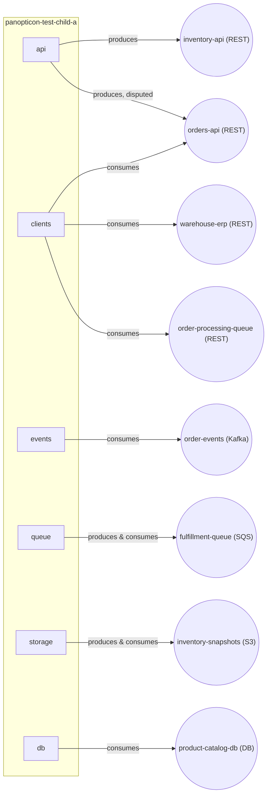

# panopticon-test-child-a — architecture overview

## Purpose

`py-inventory-service` (package `inventory`) manages product inventory: querying and updating
stock levels, reserving and releasing stock for orders, and integrating with the systems that
feed and consume inventory state (warehouse ERP, order events, fulfillment tasks, and periodic
snapshots). It is a Python 3.11+ service built on FastAPI, with supporting modules for external
clients, event consumption, async task queueing, snapshot storage, and product catalog access.

## Components

- [api](components/api.md) — REST API for querying and managing inventory levels and stock
  reservations; also hosts an in-progress, inventory-owned Orders API
- [clients](components/clients.md) — outbound HTTP clients for the orders service, the
  warehouse ERP, and an order-processing status endpoint
- [events](components/events.md) — Kafka consumer for order lifecycle events
- [queue](components/queue.md) — SQS producer/consumer for fulfillment tasks
- [storage](components/storage.md) — S3 client for daily inventory snapshots
- [db](components/db.md) — PostgreSQL access to the product catalog

## Architecture diagram

[org diagram](../architecture.md#panopticon-test-child-a)

## Data flow

As implemented today, these components are **not wired to one another** — each is a standalone
module with no cross-imports (verified: `api`, `events`, `queue`, `storage`, `clients`, and `db`
each only import third-party/stdlib packages, never each other). Concretely:

- `api` (`inventory/api/routes.py`) exposes the `inventory-api` REST interface
  (list/get/update inventory, reserve/release stock) but its handlers return placeholder data —
  they do not call `db`, `queue`, or `clients`. `api` also hosts a second app
  (`inventory/api/orders_routes.py`) that self-claims ownership of `orders-api` — the same
  canonical name and type the orders service already declares — while `clients` still consumes
  the orders service's version, an unreconciled ownership dispute.
- `events` (`inventory/events/kafka_consumer.py`) subscribes to the `order-events` Kafka topic
  and dispatches `order.created`/`order.cancelled` messages to handler stubs
  (`_on_order_created`, `_on_order_cancelled`) that are currently empty (`pass`).
- `queue` (`inventory/queue/fulfillment_queue.py`) provides enqueue/poll/delete operations
  against the `fulfillment-queue` SQS queue but is not called from `api` or `events`.
- `storage` (`inventory/storage/snapshots.py`) provides upload/download/list operations against
  the `inventory-snapshots` S3 bucket, called from nowhere else in this repo.
- `clients` (`inventory/clients/`) provides HTTP clients for `orders-api`, `warehouse-erp`, and
  `order-processing-queue`, called from nowhere else in this repo.
- `db` (`inventory/db/catalog.py`) provides read access to `product-catalog-db`, called from
  nowhere else in this repo.

See [interfaces.md](interfaces.md) for the full interface list with ownership and direction.

## Dependencies

- **`orders-api`** (REST) — order lookups via `inventory/clients/orders.py`, still against the
  order service's existing API; unavailability blocks those callers. This repo's own index also
  self-claims ownership of `orders-api` via `inventory/api/orders_routes.py` — an unreconciled
  ownership dispute with the order service's declaration, not a settled migration.
- **`warehouse-erp`** (REST, external, third-party on-premise ERP) — warehouse stock levels and
  replenishment requests; unavailability blocks `inventory/clients/erp.py` callers.
- **`order-events`** (Kafka, external, owned by the order service) — order lifecycle events
  consumed by `events`; unavailability stalls order-driven inventory updates once the handlers
  are implemented.
- **`product-catalog-db`** (database, external, managed RDS instance) — product metadata;
  unavailability blocks `inventory/db/catalog.py` callers.
- **`order-processing-queue`** (REST, external, owner unresolved) — order-processing status
  lookups from `inventory/clients/order_processing.py`. No owner is recorded in this repo's
  index; this repo has no visibility into whether another repo declares this name differently.

Full details, ownership, and consumers/producers for every interface: see
[interfaces.md](interfaces.md).
