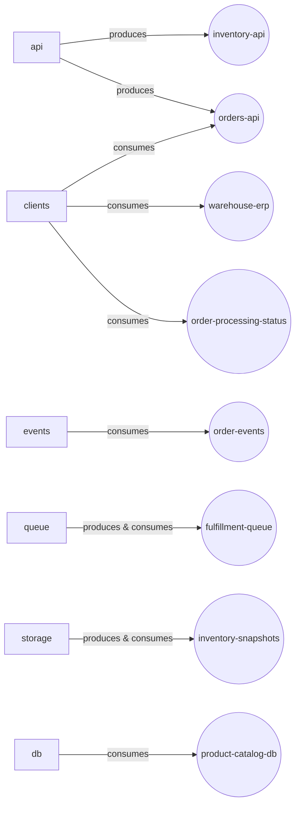

# panopticon-test-child-a — architecture overview

## Purpose

`py-inventory-service` is a Python package containing inventory-facing FastAPI applications and
separate modules for upstream clients, event consumption, queue access, snapshot storage, and
catalog-database reads. The source currently contains the interfaces and adapters, but no
cross-component orchestration.

## Components

- [api](components/api.md) — Inventory and Orders FastAPI route definitions.
- [clients](components/clients.md) — HTTP clients for Orders, warehouse, and processing-status endpoints.
- [events](components/events.md) — Kafka order-event consumer.
- [queue](components/queue.md) — SQS fulfillment-task operations.
- [storage](components/storage.md) — S3 inventory-snapshot operations.
- [db](components/db.md) — PostgreSQL catalog reads.

## Architecture diagram

```mermaid
graph LR
    api -->|produces| inventory_api((inventory-api))
    api -->|produces| orders_api((orders-api))
    clients -->|consumes| orders_api
    clients -->|consumes| warehouse_erp((warehouse-erp))
    clients -->|consumes| processing_status((order-processing-status))
    events -->|consumes| order_events((order-events))
    queue -->|produces & consumes| fulfillment_queue((fulfillment-queue))
    storage -->|produces & consumes| inventory_snapshots((inventory-snapshots))
    db -->|consumes| product_catalog_db((product-catalog-db))
```

[org diagram](https://github.com/industrial-curiosity/panopticon-test/blob/main/docs/architecture.md#panopticon-test-child-a)

## Data flow

The API modules expose route handlers that currently return placeholder responses. The event
consumer dispatches `order.created` and `order.cancelled` events to stub handlers. The client,
queue, storage, and database modules are standalone adapters; no source in this repository wires
them to one another.

## Dependencies

The local index records this repository as a consumer of `orders-api`, `warehouse-erp`,
`order-processing-status`, `order-events`, and `product-catalog-db`. It does not establish the
owners of interfaces whose owner is `null`; those ownership details are outside this repository's
local evidence. See [interfaces.md](interfaces.md) for the generated authoritative list.
