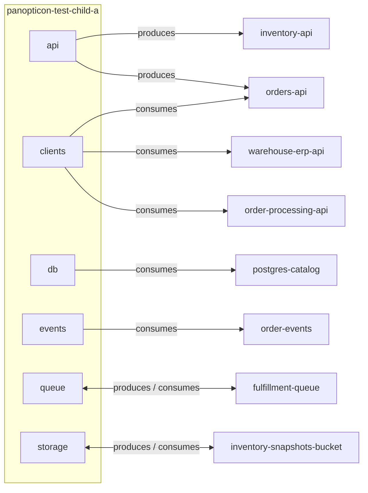

# panopticon-test-child-a — architecture overview

## Purpose

Python inventory service (`py-inventory-service`): REST inventory and orders APIs, catalog
(PostgreSQL) persistence, outbound HTTP clients for ERP, order-processing, and orders services,
background consumption of `order-events` from Kafka, fulfillment-task SQS queue usage, and
snapshot storage in an S3 bucket. The repository is a single deployable service with separate
packages per responsibility; each package imports only its own dependencies.

## Components

- [api](components/api.md) — FastAPI REST surfaces: `inventory-api` and `orders-api`
- [clients](components/clients.md) — outbound HTTP clients for ERP, order-processing, and orders
- [db](components/db.md) — PostgreSQL catalog access
- [events](components/events.md) — Kafka consumer for `order-events`
- [queue](components/queue.md) — SQS fulfillment-task queue producer/consumer
- [storage](components/storage.md) — S3 snapshot storage

## Architecture diagram

```mermaid
flowchart LR
    subgraph repo[panopticon-test-child-a]
        api[api]
        clients[clients]
        db[db]
        events[events]
        queue[queue]
        storage[storage]
    end

    api -->|produces| inventory-api[inventory-api]
    api -->|produces| orders-api[orders-api]
    clients -->|consumes| orders-api
    clients -->|consumes| warehouse-erp-api[warehouse-erp-api]
    clients -->|consumes| order-processing-api[order-processing-api]
    db -->|consumes| postgres-catalog[postgres-catalog]
    events -->|consumes| order-events[order-events]
    queue <-->|produces / consumes| fulfillment-queue[fulfillment-queue]
    storage <-->|produces / consumes| inventory-snapshots-bucket[inventory-snapshots-bucket]
```

[Panopticon analysis scope](operations.md#panopticon-analysis-scope)
[org diagram](https://github.com/industrial-curiosity/panopticon-demo/blob/main/docs/architecture.md#panopticon-test-child-a)

## Data flow

Requests arrive at the `api` component's FastAPI apps. `inventory-api`
(`inventory/api/routes.py`) serves inventory list/get/update plus reserve/release endpoints;
`orders-api` (`inventory/api/orders_routes.py`) serves order list/get. The `clients` component
makes outbound calls to `orders-api` (via `ORDERS_API_URL`), `warehouse-erp-api`
(`WAREHOUSE_ERP_URL`) for stock and replenishment, and `order-processing-api`
(`ORDER_PROCESSING_URL`) for order status. The `db` component reads the `postgres-catalog`
database. The `events` component consumes `order-events` from Kafka (`order.created`,
`order.cancelled`). The `queue` component enqueues and polls fulfillment tasks on the
`fulfillment-queue`. The `storage` component uploads and downloads inventory snapshots on the
`inventory-snapshots-bucket`.

## Dependencies

External systems this repo depends on:

- `orders-api`, `warehouse-erp-api`, `order-processing-api` — REST APIs consumed by the `clients`
  component; callers fail when they are unavailable.
- `postgres-catalog` (PostgreSQL) — catalog data store used by the `db` component.
- `order-events` (Kafka) — topic consumed by the `events` component.
- `fulfillment-queue` (SQS) — queue produced to and consumed from by the `queue` component.
- `inventory-snapshots-bucket` (S3) — bucket written and read by the `storage` component.

Consumed interfaces are listed in [interfaces.md](interfaces.md).
