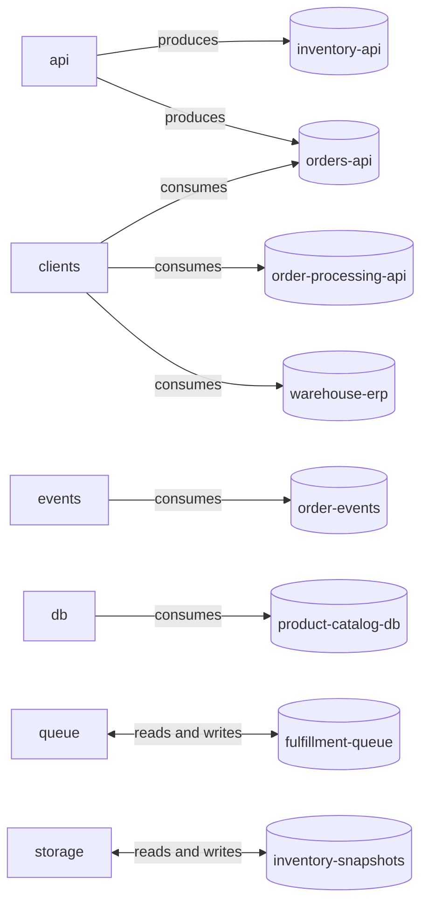

# panopticon-test-child-a — architecture overview

## Purpose

This repository contains the Python inventory service modules for inventory HTTP endpoints,
order-related integrations, event consumption, fulfillment messaging, catalog access, and
inventory snapshot storage. It exposes inventory and orders REST surfaces and provides helpers for
the external systems used by those modules.

The repository does not contain an application bootstrap that wires all modules together. The
architecture below therefore describes the interfaces and logical packages evidenced by the source
files, not an assumed deployment topology.

## Components

- [api](components/api.md) — FastAPI applications and the OpenAPI contract for inventory and orders.
- [clients](components/clients.md) — HTTP clients for orders, order processing, and the warehouse ERP.
- [db](components/db.md) — PostgreSQL catalog access through `psycopg2`.
- [events](components/events.md) — Kafka consumer for order events.
- [queue](components/queue.md) — SQS fulfillment task producer and consumer helpers.
- [storage](components/storage.md) — S3 inventory snapshot read/write helpers.

## Architecture diagram

```mermaid
flowchart LR
    api[api] -->|produces| inventory_api[(inventory-api)]
    api -->|produces| orders_api[(orders-api)]
    clients[clients] -->|consumes| orders_api
    clients -->|consumes| processing_api[(order-processing-api)]
    clients -->|consumes| warehouse_erp[(warehouse-erp)]
    events[events] -->|consumes| order_events[(order-events)]
    db[db] -->|consumes| catalog_db[(product-catalog-db)]
    queue[queue] <-->|reads and writes| fulfillment_queue[(fulfillment-queue)]
    storage[storage] <-->|reads and writes| inventory_snapshots[(inventory-snapshots)]
```

[Panopticon analysis scope](operations.md#panopticon-analysis-scope)
[org diagram](https://github.com/industrial-curiosity/panopticon-demo/blob/main/docs/architecture.md#panopticon-test-child-a)

## Data flow

The `api` component serves the `inventory-api` contract from `inventory/api/routes.py` and its
OpenAPI description. It also serves the separately named `orders-api` contract from
`inventory/api/orders_routes.py`. The route handlers currently return placeholder responses or a
404 for a missing SKU; the repository contains no application bootstrap connecting them to the
other packages.

The `clients` component makes outbound HTTP calls to `orders-api`, `order-processing-api`, and
`warehouse-erp`. The `events` component polls `order-events` and dispatches recognized order event
types to local handlers. The `db` component queries `product-catalog-db`; `queue` sends, receives,
and deletes messages on `fulfillment-queue`; and `storage` writes and reads dated objects in
`inventory-snapshots`.

## Dependencies

The repository has no same-organization package dependencies in its manifest. Its runtime
interfaces are documented in [interfaces.md](interfaces.md). The HTTP clients depend on the
availability of `orders-api`, `order-processing-api`, and `warehouse-erp`; the catalog helpers
depend on PostgreSQL; the event consumer depends on Kafka; and the queue and snapshot helpers
depend on SQS and S3 respectively. Failures from these clients propagate through the calling
module because the source does not define retry or fallback handling.
